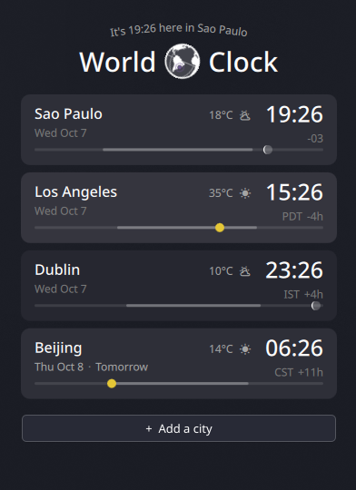
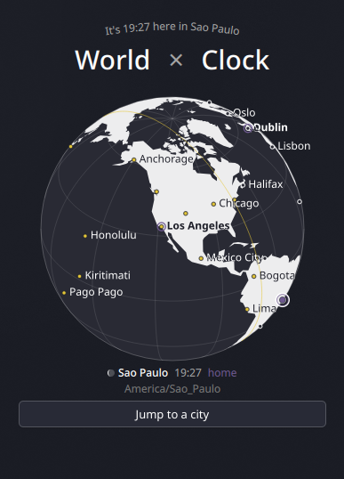

# Elsewhen for Plasma 6

A KDE Plasma 6 adaptation of Omacom's Elsewhen world clock, pinned to commit
`402128b6a2f104495038f4d52b194ac3dbd2ed28`. This is an independent Plasma
widget, not an official Omarchy plugin host.

The original city rows, globe, daylight strips, moon phases, time scrubbing,
city search, drag reordering, weather, and greeting logic are retained.
Plasma provides the panel popup, icon, theme, and per-widget settings.
A small Qt QML plugin replaces Quickshell's read-only file loader and
asynchronous process helpers. No Omarchy installation or Hyprland is required.

Tested on CachyOS with Plasma 6.7.5 and Qt 6.11.2, including use in a panel
and in a standalone window.

<p>
  
  
</p>

## Use

Right-click a KDE panel or desktop, choose **Add Widgets**, and search for
**Elsewhen**. Alternatively, open it in a separate window:

```sh
plasmawindowed org.local.elsewhen
```

Click the globe in the header to explore. Drag it to rotate; click a city to
select it. Use **Add a city** to customize the clocks, drag rows to reorder,
and click the time, temperature, or offset to switch display formats.
Drag a daylight strip, or press Left/Right, to move all clocks through time.
Escape resets shifted time, exits the globe, or closes the popup.

Your widget settings are saved by Plasma in that widget's own configuration
entry. Installing this package does not add it to a panel or replace KDE services.
Weather uses the same Open-Meteo APIs as upstream and requires internet access;
time zones and the globe assets are local.

## Build, test, install

Requires Plasma 6, Qt 6 development headers, qmake6, make, a C++ compiler,
Kirigami, bash, curl, GNU date, and timedatectl. Tests also require Qt Quick Test
(`qmltestrunner`).

```sh
git clone https://github.com/vytorrennan/elsewhen-kde.git
cd elsewhen-kde
./build.sh
./test.sh
./install.sh
```

The integration test checks real time-zone probes, add/remove, clock format,
time scrubbing, city search, globe assets and navigation, and weather fetching.
It writes `clocks.png` and `globe.png` here. The weather check requires a working
Open-Meteo connection.

The compiled native helper must be rebuilt if a future Qt update makes its ABI
incompatible. `./install.sh` rebuilds and reinstalls it. Remove all running
instances of the widget before upgrading its native helper.

User installation: `~/.local/share/plasma/plasmoids/org.local.elsewhen/`.
To uninstall, first remove its instances from your panels/desktops, then run:

```sh
kpackagetool6 --type Plasma/Applet --remove org.local.elsewhen
```

See [UPSTREAM.md](UPSTREAM.md) for provenance and [LICENSE](LICENSE) for the
original MIT notice. `upstream/` keeps the untouched original files.
